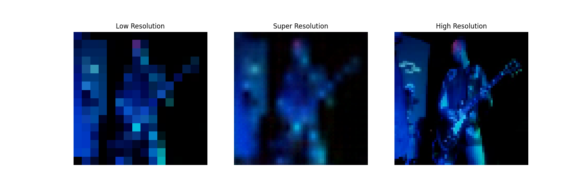
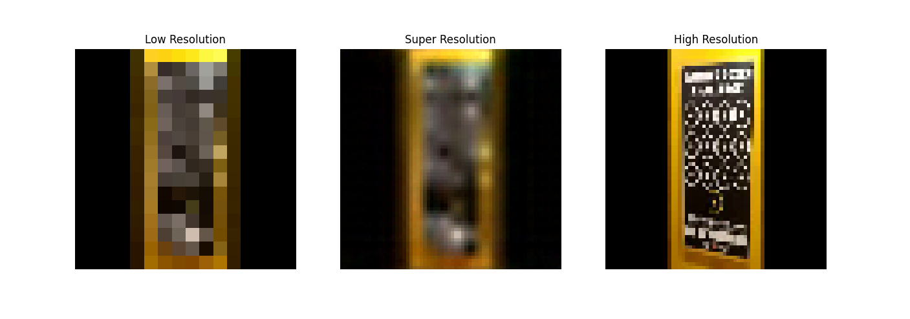

# SR1 Model Dokümantasyonu

## Model Mimarisi

### Genel Bakış
SR1, video süper çözünürlük için tasarlanmış bir derin öğrenme modelidir. Model, düşük çözünürlüklü video karelerini yüksek çözünürlüklü versiyonlarına dönüştürmek için residual bloklar ve pixel shuffle tabanlı upsampling kullanır.

### Ağ Yapısı

| Katman | Tip | Parametreler | Çıkış Boyutu |
|--------|-----|-------------|--------------|
| Input | - | [batch, frames, 3, H/4, W/4] | [batch, frames, 3, H/4, W/4] |
| Conv1 | Conv2d | in_channels=3, out_channels=32, kernel_size=3, padding=1 | [batch, frames, 32, H/4, W/4] |
| ResBlock1 | FastResidualBlock | num_channels=32 | [batch, frames, 32, H/4, W/4] |
| ResBlock2 | FastResidualBlock | num_channels=32 | [batch, frames, 32, H/4, W/4] |
| ResBlock3 | FastResidualBlock | num_channels=32 | [batch, frames, 32, H/4, W/4] |
| ResBlock4 | FastResidualBlock | num_channels=32 | [batch, frames, 32, H/4, W/4] |
| Upsample | Conv2d + PixelShuffle | in_channels=32, out_channels=32*(4^2), kernel_size=3, padding=1 | [batch, frames, 32, H, W] |
| Conv2 | Conv2d | in_channels=32, out_channels=3, kernel_size=3, padding=1 | [batch, frames, 3, H, W] |

### FastResidualBlock Detayları
Her residual blok şu katmanlardan oluşur:
1. Conv2d (3x3, padding=1)
2. ReLU aktivasyonu
3. Conv2d (3x3, padding=1)
4. Skip connection

### Parametre Sayıları
- Conv1: 3 * 32 * 3 * 3 + 32 = 896 parametre
- Her ResBlock: 2 * (32 * 32 * 3 * 3 + 32) = 18,496 parametre
- Toplam ResBlocks (4 adet): 4 * 18,496 = 73,984 parametre
- Upsample Conv: 32 * (32 * 16) * 3 * 3 + (32 * 16) = 147,968 parametre
- Conv2: 32 * 3 * 3 * 3 + 3 = 867 parametre
- Toplam: ~223,715 parametre

## Veri İşleme

### Giriş Verisi
- Format: Video kareleri
- Boyut: [batch_size, num_frames, 3, height, width]
- Normalizasyon: [0, 255] -> [0, 1]

### Ön İşleme
1. Video kareleri eşit aralıklarla seçilir (num_frames=30)
2. Her kare 64x64 boyutuna yeniden boyutlandırılır
3. BGR -> RGB dönüşümü yapılır
4. [0, 255] -> [0, 1] normalizasyonu uygulanır
5. Düşük çözünürlüklü versiyon oluşturulur (scale_factor=0.25)

## Eğitim Detayları

### Loss Fonksiyonu
- Mean Squared Error (MSE) Loss
- Formül: L = 1/N * Σ(y_true - y_pred)^2

### Optimizer
- Adam Optimizer
- Learning Rate: 0.0001
- Beta1: 0.9 (default)
- Beta2: 0.999 (default)

### Eğitim Parametreleri
- Batch Size: 32
- Epoch Sayısı: 100
- Early Stopping Patience: 10
- Validation Split: 0.15
- Test Split: 0.15

## Model Özellikleri
- Frame bazlı işleme
- Residual learning
- Pixel shuffle tabanlı upsampling
- Hafif mimari (223K parametre)
- Real-time işleme için optimize edilmiş

## Kullanım
```python
from network.sr1_model import FastSR

# Model oluşturma
model = FastSR(scale_factor=4, num_channels=32)

# Giriş boyutu: [batch, frames, 3, H/4, W/4]
# Çıkış boyutu: [batch, frames, 3, H, W]
output = model(input)
```

## Notlar
- Model her video karesini bağımsız olarak işler.
- Upsampling işlemi pixel shuffle ile yapılır.
- Residual bloklar gradient flow'u iyileştirir.
- Hafif mimarisi sayesinde real-time işleme mümkündür .

## Sonuçlar

### Görsel Karşılaştırmalar

Aşağıdaki görseller, SR1 modelinin farklı video karelerindeki performansını göstermektedir:


Şekil 1: SR1 modelinin ilk test sonucu. Soldan sağa: Orijinal düşük çözünürlüklü görüntü, model çıktısı, hedef yüksek çözünürlüklü görüntü.


Şekil 2: SR1 modelinin ikinci test sonucu. (Yazılar İçin) Soldan sağa: Orijinal düşük çözünürlüklü görüntü, model çıktısı, hedef yüksek çözünürlüklü görüntü.

### Performans Analizi

1. **Metin İşleme**
   - Video içindeki yazı ve metinlerde belirgin kayıplar
   - Karakterlerin okunabilirliğinde düşüş
   - İnce çizgilerde bozulmalar

2. **Detay Koruma**
   - İnce detayların korunmasında yetersizlik
   - Kenar keskinliğinde kayıplar
   - Doku detaylarında bulanıklaşma

3. **Genel Kalite**
   - Ortalama alma etkisi nedeniyle yumuşak geçişler
   - Yapay detay oluşturmada yetersizlik
   - Görüntü keskinliğinde düşüş

## Yorum

SR1 modeli, video süper çözünürlük alanında önemli bir başlangıç noktası olmuştur. Modelin eğitim sürecinde karşılaşılan zorluklar, sonraki modellerin geliştirilmesinde kritik rol oynamıştır.

Eğitim sürecinde, loss değerlerinin beklenenden çok düşük seyretmesi ve ilk 15 epoch'ta önemli bir değişim gözlenmemesi, MSE loss fonksiyonunun bu tür bir süper çözünürlük problemi için yeterince efektif olmadığını ortaya koymuştur. Zaten üstteki sonuçlarda görüldüğü üzere bir nevi MSE fonksiyonuyla model ortalama almayı öğrenmektedir ki bu tarz bir yöntem oldukça basit bir çözüm olarak karşımıza çıkmaktadır. Videoların karmaşıklığı dikkate alındığında efektif bir çözüm sunamamaktadır. Ayrıca video içindeki yazı ve metin gibi daha karmaşık ayrımlarda tamamen o bilginin gittiği gözlemlenmektedir. Bu durum, görüntü kalitesi iyileştirme için daha sofistike loss fonksiyonlarına ihtiyaç olduğunu göstermiştir. Ayrıca, 4x süper çözünürlük hedefinin Grace modeli ile entegrasyon açısından uyumsuzluk yaratması, daha gerçekçi bir hedef belirleme ihtiyacını doğurmuştur.

Bu deneyimler ışığında, sonraki modellerde önemli değişiklikler yapılmıştır. Öncelikle, MSE loss yerine daha efektif loss fonksiyonları kullanılmaya başlanmış ve görüntü kalitesi metriklerinin loss hesaplamasına dahil edilmesi planlanmıştır. Ayrıca, 4x süper çözünürlük hedefinden 240p'den 128p'ye (1.85x) geçiş yapılarak, Grace modeli ile daha iyi entegrasyon sağlanmıştır.

Modelin başarılı yönleri de göz ardı edilmemelidir. Hafif mimari yapısı ve residual blokların kullanımı, gradient flow açısından etkili bir yaklaşım sunmuştur. Frame bazlı işleme yaklaşımı da modelin real-time işleme yeteneklerini korumasını sağlamıştır. Bu deneyimler, sonraki modellerin (SR2, SR3, SR4) geliştirilmesinde temel oluşturmuş ve daha başarılı sonuçlar elde edilmesini sağlamıştır.
