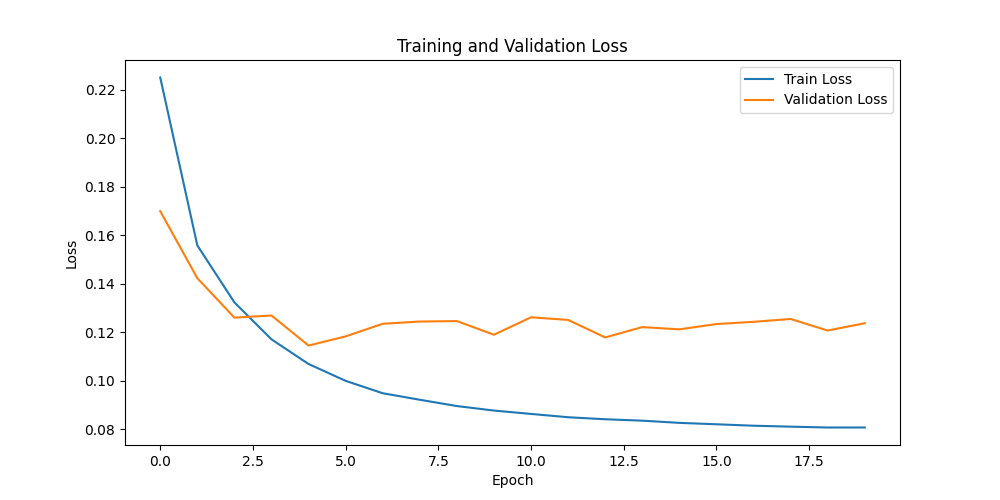
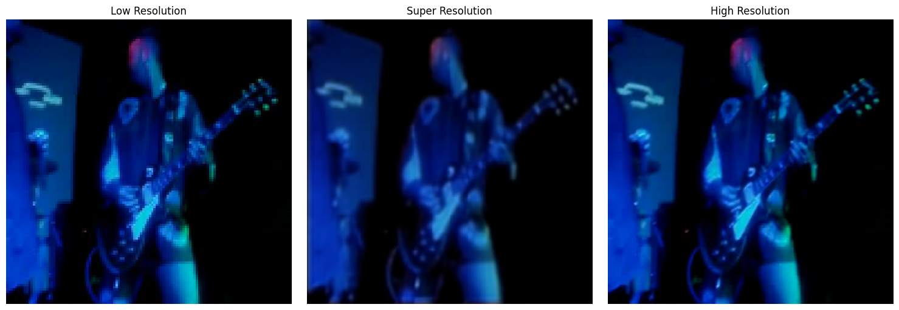
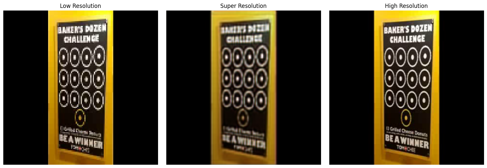

# SR2 Model Dokümantasyonu

## Genel Bakış
SR2 modeli, video süper çözünürlük işlemi için geliştirilmiş bir derin öğrenme modelidir. SR1 modelinin temel yapısını koruyarak, performansı artırmak için ek özellikler ve iyileştirmeler içerir.

## Model Mimarisi

### Ağ Yapısı
| Katman Tipi | Parametreler | Çıktı Boyutu |
|------------|------------|-------------|
| Input | - | (B, 3, H, W) |
| Initial Conv | 3→24, k=3, s=1, p=1 | (B, 24, H, W) |
| Residual Blocks (8x) | 24→24, k=3, s=1, p=1 | (B, 24, H, W) |
| Conv Mid | 24→24, k=3, s=1, p=1 | (B, 24, H, W) |
| Upscale Conv1 | 24→96, k=3, s=1, p=1 | (B, 96, H, W) |
| PixelShuffle | scale=2 | (B, 24, 2H, 2W) |
| Upscale Conv2 | 24→24, k=3, s=1, p=1 | (B, 24, 2H, 2W) |
| Upscale Conv3 | 24→3, k=3, s=1, p=1 | (B, 3, 2H, 2W) |
| AdaptiveAvgPool | (240,240) | (B, 3, 240, 240) |

### FastResidualBlock Detayları
- İki adet 3x3 konvolüsyon katmanı
- Batch Normalization
- ReLU aktivasyonu
- SE (Squeeze-and-Excitation) katmanı
- Dropout (0.1 oranında)
- Skip connection

## Model Parametreleri
- Toplam parametre sayısı: ~117,251
- Initial Conv: 672 parametre
- Residual Blocks (8 adet): 84,680 parametre
- Conv Mid: 5,208 parametre
- Upscale Katmanları: 26,691 parametre

## Veri İşleme
### Giriş Formatı
- Video formatı: MP4, AVI
- Frame boyutu: 64x64 (düşük çözünürlük)
- Renk kanalları: RGB (3 kanal)

### Ön İşleme Adımları
1. Video dosyalarından eşit aralıklarla frame seçimi
2. Frame'lerin 64x64 boyutuna yeniden boyutlandırılması
3. Normalizasyon (0-1 aralığına)
4. Tensor dönüşümü

## Eğitim Detayları
### Kayıp Fonksiyonları ve Optimizasyon

SR2 modelinde, görüntü kalitesini artırmak ve modelin öğrenme sürecini iyileştirmek için üç farklı kayıp fonksiyonu birleştirilerek kullanılmıştır. Bu yaklaşım, hem piksel seviyesinde doğruluk hem de yapısal benzerlik açısından daha iyi sonuçlar elde edilmesini sağlamıştır.

### 1. L1 Loss (α=0.7)
L1 loss (Mean Absolute Error), piksel seviyesinde doğruluğu ölçen temel bir kayıp fonksiyonudur. Yüksek çözünürlüklü hedef görüntü ile model çıktısı arasındaki mutlak farkları hesaplar. MSE'ye göre daha az hassas olmasına rağmen, daha sağlam sonuçlar üretir ve aşırı bulanıklaşmayı önler. SR2 modelinde L1 loss'un ağırlığı 0.7 olarak belirlenmiştir.

### 2. Perceptual Loss (β=0.2)
Perceptual loss, görüntülerin yüksek seviyeli özelliklerini karşılaştırarak hesaplanır. Bu amaçla, önceden eğitilmiş VGG19 ağının ilk 5 katmanından çıkarılan özellik haritaları kullanılır. Bu yaklaşım, görüntülerin yapısal ve semantik benzerliğini ölçmede daha etkilidir. Perceptual loss'un ağırlığı 0.2 olarak ayarlanmıştır.

### 3. SSIM Loss (γ=0.1)
SSIM (Structural Similarity Index Measure) loss, görüntülerin yapısal benzerliğini ölçen bir metrik kullanır. Bu fonksiyon, parlaklık, kontrast ve yapısal bilgiyi dikkate alarak görüntülerin kalitesini değerlendirir. SSIM loss'un ağırlığı 0.1 olarak belirlenmiştir.

### Combined Loss Fonksiyonu
Bu üç kayıp fonksiyonu, aşağıdaki formül ile birleştirilmiştir:

```
L_total = α * L_L1 + β * L_perceptual + γ * L_SSIM
```

Bu birleştirilmiş yaklaşım sayesinde:
- L1 loss ile temel piksel doğruluğu sağlanır
- Perceptual loss ile görsel kalite ve yapısal benzerlik korunur
- SSIM loss ile görüntülerin yapısal bütünlüğü muhafaza edilir

### Optimizer
- Adam Optimizer
  - Learning Rate: 0.0001
  - Beta1: 0.9
  - Beta2: 0.999
  - Weight Decay: 0.0001

### Eğitim Parametreleri
- Batch Size: 32
- Epoch Sayısı: 100
- Early Stopping Patience: 10
- Learning Rate Scheduler: ReduceLROnPlateau
  - Factor: 0.5
  - Patience: 5
  - Min LR: 1e-6

## Değerlendirme Metrikleri
- PSNR (Peak Signal-to-Noise Ratio)
- SSIM (Structural Similarity Index)
- Validation Loss
- Training Loss

## Model Özellikleri
1. Geliştirilmiş Residual Blocks
   - SE katmanları ile kanal dikkat mekanizması
   - Dropout ile regularizasyon
   - Batch Normalization ile stabilizasyon
2. Combined Loss Function
   - L1 Loss
   - Perceptual Loss
   - SSIM Loss
3. Learning Rate Scheduling
   - Dinamik öğrenme oranı ayarlaması
   - Early stopping
4. Checkpoint Saving
   - Her 5 epoch'ta bir kayıt
   - En iyi modelin saklanması

## Kullanım Örneği
```python
from network.sr2_model import FastSR
from processing.dataset import VideoDataset
from utils.trainer import train_with_validation
from config.config import MODEL_CONFIG, DATASET_CONFIG

# Model oluşturma
model = FastSR(
    scale_factor=MODEL_CONFIG['scale_factor'],
    num_channels=MODEL_CONFIG['num_channels'],
    num_blocks=MODEL_CONFIG['num_blocks'],
    dropout_rate=MODEL_CONFIG['dropout_rate']
)

# Dataset oluşturma
dataset = VideoDataset(
    video_paths,
    hr_size=DATASET_CONFIG['hr_size'],
    lr_size=DATASET_CONFIG['lr_size'],
    num_frames=DATASET_CONFIG['num_frames']
)

# Model eğitimi
train_with_validation(
    model=model,
    train_loader=train_loader,
    val_loader=val_loader,
    criterion=criterion,
    optimizer=optimizer,
    device=device,
    num_epochs=100,
    patience=10,
    save_dir="checkpoints/sr2"
)
```


## Sonuçlar

### Eğitim Kayıp Eğrisi


Şekil 1: SR2 modelinin eğitim süreci

### Görsel Karşılaştırmalar

Aşağıdaki görseller, SR2 modelinin farklı video karelerindeki performansını göstermektedir:


Şekil 1: SR2 modelinin ilk test sonucu. Soldan sağa: Orijinal düşük çözünürlüklü görüntü, model çıktısı, hedef yüksek çözünürlüklü görüntü.


Şekil 2: SR2 modelinin ikinci test sonucu. (Yazılar İçin) Soldan sağa: Orijinal düşük çözünürlüklü görüntü, model çıktısı, hedef yüksek çözünürlüklü görüntü.


## Yorumlar
SR2 modeli, SR1'e göre önemli iyileştirmeler içermektedir. SE (Squeeze-and-Excitation) katmanları ile kanal dikkat mekanizması eklenmiş, bu sayede önemli özelliklerin daha iyi öğrenilmesi sağlanmıştır. Batch Normalization ve Dropout ile model stabilizasyonu ve regularizasyonu güçlendirilmiştir. Özellikle early stopping ile model overfit olmadan en iyi haline yakın bir seviyede eğitim sonlandırılmıştır. Yukarıdaki epochlardaki train ve validasyon lossları da bunu göstermektedir. Progressive upsampling yaklaşımı ile daha yumuşak ve detaylı görüntü iyileştirmesi elde edilmiştir. 

Combined loss function yaklaşımı ile önemli bir başarı elde edilmiştir:
   - L1 loss ile temel piksel doğruluğu sağlanmış
   - Perceptual loss ile görsel kalite ve yapısal benzerlik korunmuş
   - SSIM loss ile görüntülerin yapısal bütünlüğü muhafaza edilmiş
   - Bu üç kayıp fonksiyonunun optimal ağırlıklarla birleştirilmesi, hem objektif metriklerde (PSNR, SSIM) hem de subjektif görsel kalitede iyileşme sağlamıştır

Parametre sayısı SR1'e göre daha az olmasına rağmen (117,251 vs 223,715), daha iyi performans elde edilmiştir. Memory optimizasyonu için autocast kullanımı ile eğitim süreci hızlandırılmıştır. Ancak sonuçlarda görüldüğü üzere hala daha özellikle yazı ve şekilsel karmaşıklığın fazla olduğu noktalarda düzgün bir açılım yapılamamaktadır. Bundan sonraki modellerde eğitirliken bu göz önünde bulundurulmaya çalışılmıştır.

