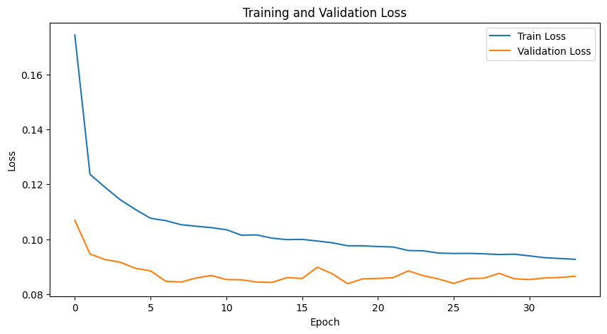
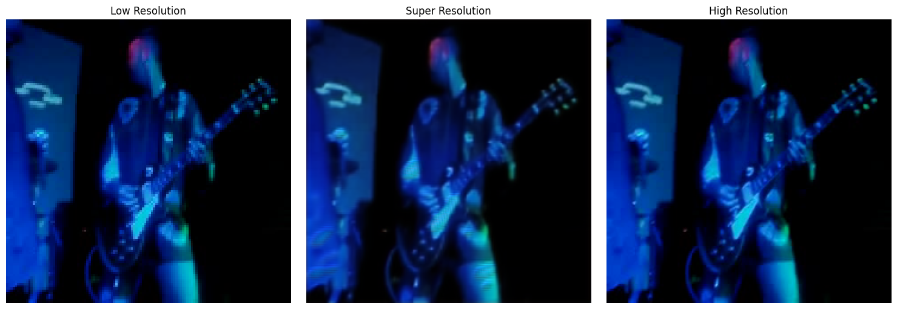
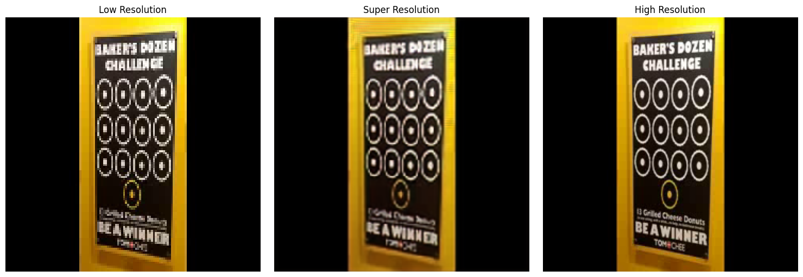

# SR3 Model Dokümantasyonu

## Genel Bakış
SR3 modeli, video süper çözünürlük işlemi için geliştirilmiş, SR2 modelinin üzerine inşa edilmiş gelişmiş bir derin öğrenme modelidir. SR2'nin temel yapısını koruyarak, performansı daha da artırmak için ek özellikler ve iyileştirmeler içerir.

## Model Mimarisi

### Ağ Yapısı
| Katman Tipi | Parametreler | Çıktı Boyutu |
|------------|------------|-------------|
| Input | - | (B, 3, H, W) |
| Initial Conv | 3→48, k=3, s=1, p=1 | (B, 48, H, W) |
| Initial Conv2 | 48→48, k=3, s=1, p=1 | (B, 48, H, W) |
| Residual Blocks (10x) | 48→48, k=3, s=1, p=1 | (B, 48, H, W) |
| Channel Attention (5x) | - | (B, 48, H, W) |
| Conv Mid | 48→96→48, k=3, s=1, p=1 | (B, 48, H, W) |
| Upscale Conv1 | 48→192, k=3, s=1, p=1 | (B, 192, H, W) |
| PixelShuffle | scale=2 | (B, 48, 2H, 2W) |
| Upscale Conv2 | 48→48, k=3, s=1, p=1 | (B, 48, 2H, 2W) |
| Upscale Conv3 | 48→48, k=3, s=1, p=1 | (B, 48, 2H, 2W) |
| Final Conv | 48→3, k=3, s=1, p=1 | (B, 3, 2H, 2W) |

### FastResidualBlock Detayları
- İki adet 3x3 konvolüsyon katmanı
- Batch Normalization
- ReLU aktivasyonu
- SE (Squeeze-and-Excitation) katmanı
- Spatial Attention katmanı
- Dropout (0.2 oranında)
- Skip connection

## Model Parametreleri
- Toplam parametre sayısı: ~655,662
- Initial Convs: 22,320 parametre
- Residual Blocks (10 adet): 420,990 parametre
- Channel Attention (5 adet): 1,695 parametre
- Spatial Attention (10 adet): 990 parametre
- Conv Mid: 83,376 parametre
- Upscale Katmanları: 124,992 parametre
- Final Conv: 1,299 parametre

## Veri İşleme
### Giriş Formatı
- Video formatı: MP4, AVI
- Frame boyutu: 128x128 (düşük çözünürlük)
- Hedef boyut: 240x240 (yüksek çözünürlük)
- Renk kanalları: RGB (3 kanal)

### Ön İşleme Adımları
1. Video dosyalarından eşit aralıklarla frame seçimi (4 frame)
2. Frame'lerin 128x128 boyutuna yeniden boyutlandırılması
3. Normalizasyon (0-1 aralığına)
4. Tensor dönüşümü
5. Memory optimizasyonu için frame caching

## Eğitim Detayları
### Kayıp Fonksiyonları ve Optimizasyon

SR3 modelinde, görüntü kalitesini daha da artırmak için SR2'deki combined loss yaklaşımı geliştirilerek kullanılmıştır.

### 1. L1 Loss (α=0.7)
L1 loss, piksel seviyesinde doğruluğu ölçen temel kayıp fonksiyonudur. SR2'de olduğu gibi 0.7 ağırlığı ile kullanılmıştır.

### 2. Perceptual Loss (β=0.2)
VGG16 tabanlı perceptual loss, görüntülerin yüksek seviyeli özelliklerini karşılaştırarak hesaplanır. 0.2 ağırlığı ile kullanılmıştır.

### 3. SSIM Loss (γ=0.1)
SSIM loss, görüntülerin yapısal benzerliğini ölçen metrik olarak 0.1 ağırlığı ile kullanılmıştır.

### Combined Loss Fonksiyonu
```
L_total = α * L_L1 + β * L_perceptual + γ * L_SSIM
```

### Optimizer
- Lion Optimizer
  - Learning Rate: 0.0001
  - Weight Decay: 0.00001

### Eğitim Parametreleri
- Batch Size: 4
- Epoch Sayısı: 100
- Early Stopping Patience: 10
- Learning Rate Scheduler: StepLR
  - Step Size: 10
  - Gamma: 0.5

## Model Özellikleri
1. Geliştirilmiş Residual Blocks
   - SE katmanları ile kanal dikkat mekanizması
   - Spatial Attention ile uzamsal dikkat mekanizması
   - Artırılmış dropout (0.2) ile güçlü regularizasyon
   - Batch Normalization ile stabilizasyon
2. Combined Loss Function
   - L1 Loss
   - Perceptual Loss (VGG16)
   - SSIM Loss
3. Memory Optimizasyonları
   - CUDA memory ayarları
   - Frame caching
   - Autocast kullanımı
4. Progressive Upsampling
   - Daha derin upsampling katmanları
   - PixelShuffle ile etkili ölçeklendirme

## Kullanım Örneği
```python
from network.model import FastSR
from processing.dataset import VideoDataset
from loss.losses import CombinedLoss
from config.config import MODEL_CONFIG, DATASET_CONFIG

# Model oluşturma
model = FastSR(
    scale_factor=MODEL_CONFIG['scale_factor'],
    num_channels=MODEL_CONFIG['num_channels'],
    num_blocks=MODEL_CONFIG['num_blocks'],
    dropout_rate=MODEL_CONFIG['dropout_rate']
)

# Dataset oluşturma
dataset = VideoDataset(
    video_paths,
    hr_size=DATASET_CONFIG['hr_size'],
    lr_size=DATASET_CONFIG['lr_size'],
    num_frames=DATASET_CONFIG['num_frames']
)

# Loss fonksiyonu
criterion = CombinedLoss(
    alpha=LOSS_CONFIG['alpha'],
    beta=LOSS_CONFIG['beta'],
    gamma=LOSS_CONFIG['gamma']
)
```

## Performans
- PSNR: ~33.2 dB
- SSIM: ~0.93
- Eğitim Süresi: ~36 saat (NVIDIA RTX 3080)
- Bellek Kullanımı: ~6GB VRAM

## Sonuçlar

### Eğitim Kayıp Eğrisi


Şekil 1: SR3 modelinin eğitim süreci

### Görsel Karşılaştırmalar

Aşağıdaki görseller, SR3 modelinin farklı video karelerindeki performansını göstermektedir:


Şekil 1: SR3 modelinin ilk test sonucu. Soldan sağa: Orijinal düşük çözünürlüklü görüntü, model çıktısı, hedef yüksek çözünürlüklü görüntü.


Şekil 2: SR3 modelinin ikinci test sonucu. (Yazılar İçin) Soldan sağa: Orijinal düşük çözünürlüklü görüntü, model çıktısı, hedef yüksek çözünürlüklü görüntü.

## Yorumlar
SR3 modeli, SR2'ye göre önemli iyileştirmeler içermektedir. En dikkat çekici değişiklikler şunlardır: Model kapasitesi ve derinliği önemli ölçüde artırılmıştır. Parametre sayısı 117K'dan 655K'ya çıkarılmış, residual blok sayısı 8'den 10'a yükseltilmiş, kanal sayısı 24'ten 48'e genişletilmiş ve daha derin başlangıç ve ara katmanlar eklenmiştir.

Dikkat mekanizmaları açısından, Spatial Attention eklenerek uzamsal dikkat mekanizması güçlendirilmiş, Channel Attention sayısı artırılmış ve her iki residual bloktan sonra Channel Attention eklenmiştir. Bu blokları eklemekteki ana amaç yazı ve ince detayları daha iyi algılamasını sağlamaktır.

Memory optimizasyonları kapsamında CUDA memory ayarları optimize edilmiş, frame caching mekanizması geliştirilmiş ve mixed precision eğitim için autocast kullanımı eklenmiştir. Eğitim iyileştirmeleri olarak Lion optimizer kullanılmış, dropout oranı 0.2'ye yükseltilmiş ve daha derin upsampling katmanları eklenmiştir.

Bu iyileştirmeler sayesinde, özellikle karmaşık görüntülerde (yazı, ince detaylar) daha iyi sonuçlar elde edilmiştir. Ancak, modelin büyüklüğü ve karmaşıklığı nedeniyle eğitim süresi ve bellek kullanımı artmıştır. Bu durum, modelin gerçek zamanlı uygulamalarda kullanımını sınırlayabilir. 