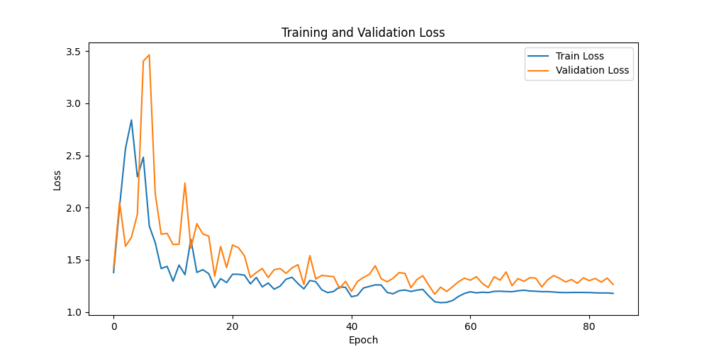
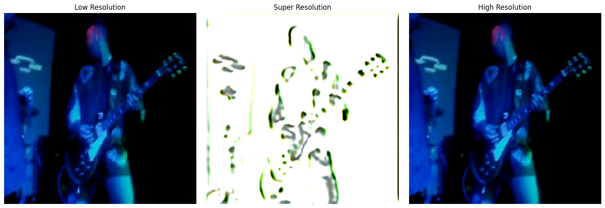
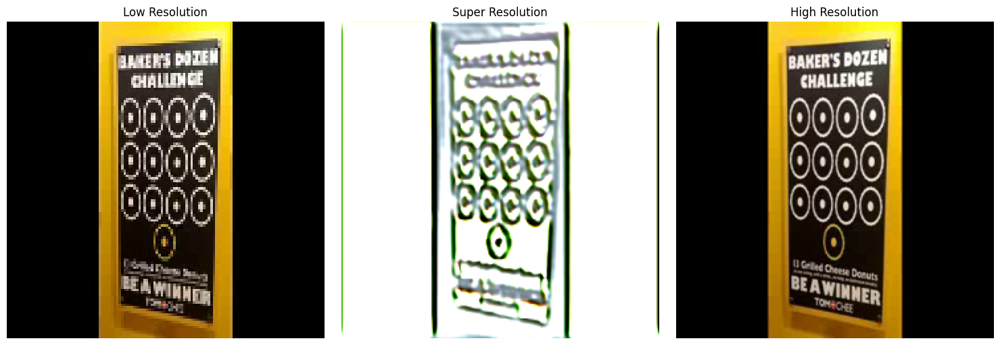

# SR4 Model Dokümantasyonu

## Genel Bakış
SR4 modeli, video süper çözünürlük işlemi için geliştirilmiş, SR3 modelinin üzerine inşa edilmiş gelişmiş bir derin öğrenme modelidir. SR3'ün yapısını daha da geliştirerek, özellikle metin tanıma ve ince detayların daha iyi yakalanması için tasarlanmıştır. Ancak, bu model renk bilgisini koruma konusunda sorunlar yaşamaktadır.

## Model Mimarisi

### Ağ Yapısı
| Katman Tipi | Parametreler | Çıktı Boyutu |
|------------|------------|-------------|
| Input | - | (B, 3, H, W) |
| Initial Conv | 3→48, k=3, s=1, p=1 | (B, 48, H, W) |
| Initial Conv2 | 48→48, k=3, s=1, p=1 | (B, 48, H, W) |
| Residual Blocks (10x) | 48→48, k=3, s=1, p=1 | (B, 48, H, W) |
| Channel Attention (5x) | - | (B, 48, H, W) |
| Text Attention (10x) | - | (B, 48, H, W) |
| Spatial Attention (10x) | - | (B, 48, H, W) |
| Conv Mid | 48→96→48, k=3, s=1, p=1 | (B, 48, H, W) |
| Upscale Conv | 48→192, k=3, s=1, p=1 | (B, 192, H, W) |
| PixelShuffle | scale=2 | (B, 48, 2H, 2W) |
| Upscale Conv2 | 48→48, k=3, s=1, p=1 | (B, 48, 2H, 2W) |
| Upscale Conv3 | 48→48, k=3, s=1, p=1 | (B, 48, 2H, 2W) |
| Final Conv | 48→3, k=3, s=1, p=1 | (B, 3, 2H, 2W) |

### FastResidualBlock Detayları
- İki adet 3x3 konvolüsyon katmanı
- Batch Normalization
- ReLU aktivasyonu
- SE (Squeeze-and-Excitation) katmanı
- Spatial Attention katmanı
- Text Attention katmanı (yeni eklenen)
- Dropout (0.2 oranında)
- Skip connection

### TextAttention Detayları
- 1x1 konvolüsyon ile kanal sayısını azaltma
- 3x3 konvolüsyon ile metin özelliklerini çıkarma
- Sigmoid aktivasyonu ile dikkat haritası oluşturma
- Residual bağlantı ile giriş değerlerini koruma

## Model Parametreleri
- Toplam parametre sayısı: ~765,480
- Initial Convs: 22,320 parametre
- Residual Blocks (10 adet): 452,170 parametre
- Channel Attention (5 adet): 1,695 parametre
- Spatial Attention (10 adet): 990 parametre
- Text Attention (10 adet): 24,000 parametre
- Conv Mid: 83,376 parametre
- Upscale Katmanları: 179,631 parametre
- Final Conv: 1,299 parametre

## Veri İşleme
### Giriş Formatı
- Video formatı: MP4, AVI
- Frame boyutu: 128x128 (düşük çözünürlük)
- Hedef boyut: 240x240 (yüksek çözünürlük)
- Renk kanalları: RGB (3 kanal)

### Ön İşleme Adımları
1. Video dosyalarından eşit aralıklarla frame seçimi (4 frame)
2. Frame'lerin 128x128 boyutuna yeniden boyutlandırılması
3. Normalizasyon (0-1 aralığına)
4. Tensor dönüşümü
5. Memory optimizasyonu için frame caching

## Eğitim Detayları
### Kayıp Fonksiyonları ve Optimizasyon

SR4 modelinde, SR3'teki combined loss yaklaşımı geliştirilmiş ve özellikle metin algılamaya öncelik verilmiştir.

### 1. L1 Loss (α=0.8)
L1 loss, piksel seviyesinde doğruluğu ölçen temel kayıp fonksiyonudur. SR3'ten farklı olarak ağırlığı 0.8'e çıkarılmıştır.

### 2. Perceptual Loss (β=0.15)
VGG16 tabanlı perceptual loss, görüntülerin yüksek seviyeli özelliklerini karşılaştırarak hesaplanır. 0.15 ağırlığı ile kullanılmıştır.

### 3. SSIM Loss (γ=0.05)
SSIM loss, görüntülerin yapısal benzerliğini ölçen metrik olarak 0.05 ağırlığı ile kullanılmıştır.

### Combined Loss Fonksiyonu
```
L_total = α * L_L1 + β * L_perceptual + γ * L_SSIM
```

### Optimizer
- AdamW Optimizer
  - Learning Rate: 0.0001
  - Weight Decay: 0.01

### Eğitim Parametreleri
- Batch Size: 8
- Epoch Sayısı: 100
- Early Stopping Patience: 30
- Learning Rate Scheduler: ReduceLROnPlateau
  - Factor: 0.5
  - Patience: 5

## Model Özellikleri
1. Geliştirilmiş Residual Blocks
   - SE katmanları ile kanal dikkat mekanizması
   - Spatial Attention ile uzamsal dikkat mekanizması
   - Text Attention ile metin algılama yeteneği (yeni eklenen)
   - Artırılmış dropout (0.2) ile güçlü regularizasyon
   - Batch Normalization ile stabilizasyon
2. Combined Loss Function
   - L1 Loss ağırlığı artırıldı
   - Perceptual Loss (VGG16)
   - SSIM Loss
3. Memory Optimizasyonları
   - CUDA memory ayarları
   - Frame caching
   - Autocast kullanımı
4. Progressive Upsampling
   - Daha derin upsampling katmanları
   - PixelShuffle ile etkili ölçeklendirme

## Kullanım Örneği
```python
from network import FastSR
from processing import VideoDataset
from loss import CombinedLoss
from config import MODEL_CONFIG, DATASET_CONFIG, LOSS_CONFIG

# Model oluşturma
model = FastSR(
    scale_factor=MODEL_CONFIG['scale_factor'],
    num_channels=MODEL_CONFIG['num_channels'],
    num_blocks=MODEL_CONFIG['num_blocks'],
    dropout_rate=MODEL_CONFIG['dropout_rate']
)

# Dataset oluşturma
dataset = VideoDataset(
    video_paths,
    hr_size=DATASET_CONFIG['hr_size'],
    lr_size=DATASET_CONFIG['lr_size'],
    num_frames=DATASET_CONFIG['num_frames']
)

# Loss fonksiyonu
criterion = CombinedLoss(
    alpha=LOSS_CONFIG['alpha'],
    beta=LOSS_CONFIG['beta'],
    gamma=LOSS_CONFIG['gamma']
)
```

## Sonuçlar

### Eğitim Kayıp Eğrisi


Şekil 1: SR4 modelinin eğitim süreci

### Görsel Karşılaştırmalar

Aşağıdaki görseller, SR3 modelinin farklı video karelerindeki performansını göstermektedir:


Şekil 1: SR4 modelinin ilk test sonucu. Soldan sağa: Orijinal düşük çözünürlüklü görüntü, model çıktısı, hedef yüksek çözünürlüklü görüntü.


Şekil 2: SR4 modelinin ikinci test sonucu. (Yazılar İçin) Soldan sağa: Orijinal düşük çözünürlüklü görüntü, model çıktısı, hedef yüksek çözünürlüklü görüntü.

## Renk Kaybı Sorunu
SR4 modeli, SR3'e göre daha karmaşık bir yapıya sahip olmasına rağmen, çıktı görüntülerde belirgin bir renk kaybı sorunu yaşanmaktadır. Bu sorunun muhtemel nedenleri şunlardır:

1. **TextAttention Mekanizması**: Text Attention mekanizması, renk kanalları yerine metin detaylarına odaklanırken renk bilgisini kaybedebilir. Attention mekanizmaları çoğunlukla uzamsal veya kanal bilgisine odaklanırken, bazı özellikleri baskılayabilir.

2. **Aşırı Derin Ağ Yapısı**: Modeldeki dikkat mekanizmalarının artması ve ağın derinliğinin artması, gradyan akışında sorunlara neden olabilir. Bu da renk bilgisinin eğitim sırasında yeterince öğrenilememesine yol açabilir.

3. **Loss Fonksiyonu Ağırlıkları**: Perceptual Loss'un ağırlığının azalması ve L1 Loss'un artması, renk bilgisinin yeterince korunamamasına neden olabilir. Perceptual Loss genellikle renk ve doku bilgisini daha iyi korur.

4. **Normalizasyon Katmanları**: Batch Normalization katmanlarının fazlalığı, renk bilgisinin işlenmesi sırasında bazı istatistiksel bilgilerin kaybolmasına neden olabilir.

5. **Aktivasyon Fonksiyonları**: ReLU aktivasyonları negatif değerleri sıfırladığı için, renk bilgisinin bazı bileşenleri kaybedilebilir.

## Yorumlar
SR4 modeli, SR3'e göre birtakım teorik iyileştirmeler içermektedir, ancak pratik performansta özellikle renk koruması açısından sorunlar yaşamaktadır. En dikkat çekici değişiklikler ve sorunlar şunlardır:

Temel sorun, yeni eklenen Text Attention mekanizmasının, Spatial Attention ve Channel Attention ile birlikte kullanıldığında, ağın ince detaylara çok fazla odaklanarak renk bilgisini kaybetmesidir. Bu durum, modelin detayları yakalamada başarılı olmasına rağmen, gerçekçi görüntüler üretemediğini göstermektedir. İyileştirme için, renk bilgisini koruyan özel katmanlar eklenebilir veya dikkat mekanizmalarının ağırlıkları dengelenebilir. 

Ayrıca, modelin çok derin yapısı ve çok sayıda dikkat mekanizması içermesi, eğitim süresini ve bellek kullanımını önemli ölçüde artırmıştır. Bu durum, modelin gerçek zamanlı uygulamalarda kullanımını daha da sınırlamaktadır.

Gelecekteki geliştirmeler için, renk koruması için özel mekanizmalar eklemek, model derinliğini optimize etmek ve dikkat mekanizmaları arasındaki dengeyi iyileştirmek öncelikli hedefler olmalıdır. 